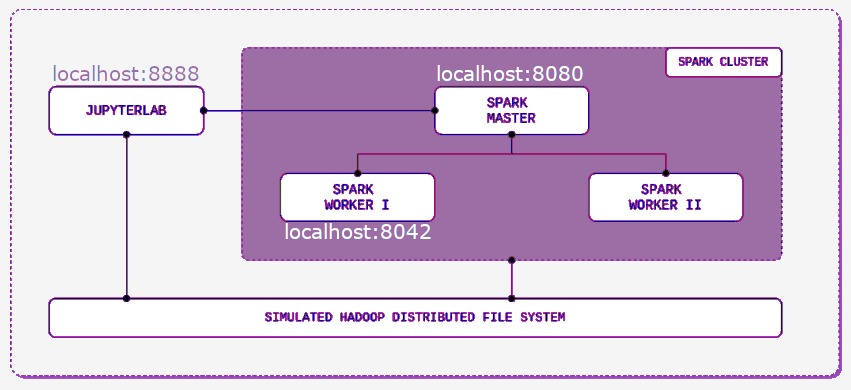
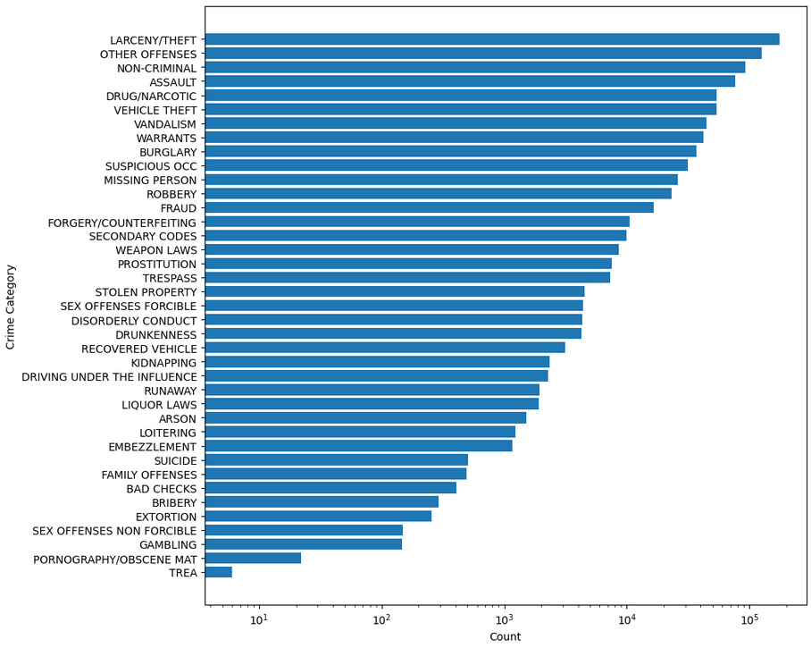

# SFCC-San Francisco Crime Classification
## Big Data and Analytics project at UniBO

The aim of this project is to explore and analyze a dataset and perform different machine learning task on top of an Apache Spark cluster built using Docker with a Jupyter Lab interface.

  

### Task and Dataset
The task consists of a multi class classification where we want to predict which category of crime was committed given several features, among which day of the week, month, year, description and so on. We have 878049 instances splitted in train (80%) and test (20%) sets. The total umber of features used is 6 and we have 39 different values for the target feature (category)

  

### Models
For this task I employed several model with the best one resulting in Naive Bayes (with 0.996 macro avg F1 score).
Models employed:
- Logistic regression with Count Vector features
- Logistic regression with TF-IDF features
- Naive Bayes
- Random Forest

I also use Cross Validator in order to find the best model and parameters. I use a 5-fold cross validator which generates 5 sets of training/testing pairs. To evaluate a particular model/param selection, CrossValidator computes the average evaluation metrics for the 5 models fitted on the 5 train/test pairs.
